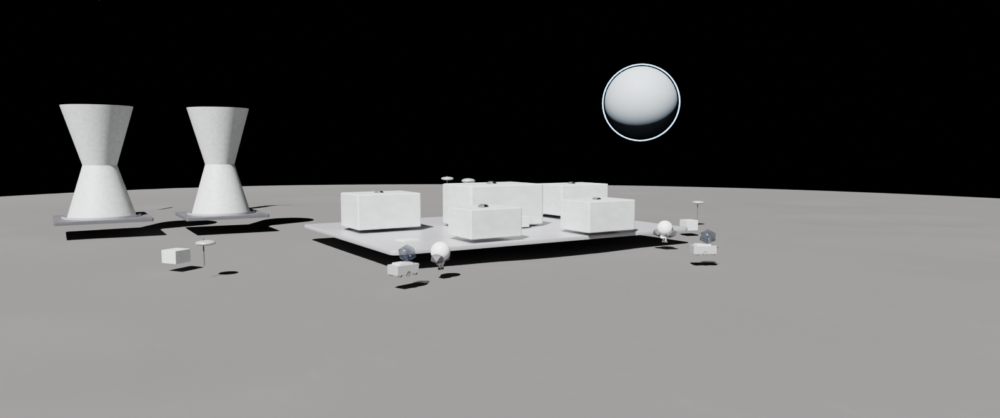

# 3DMoonX



3DMoonX is a cinematic lunar-industrial-base experience for the web. It combines a Blender-authored source scene with a React + React Three Fiber front end so the same world can be regenerated as a polished preview render, a reusable `.blend`, and a lightweight browser-ready `GLB`.

## Live links

- Live site: [3dmoonx.vercel.app](https://3dmoonx.vercel.app)
- Repository: [github.com/zrt219/3DMoonX](https://github.com/zrt219/3DMoonX)
- Case study: [CASESTUDY.md](./CASESTUDY.md)

## What this project does

3DMoonX recreates a futuristic lunar power and research outpost as an art-directed web experience.

- A wide cinematic composition centers the base on the Moon's surface.
- Cooling towers anchor the left-rear silhouette.
- Earth appears above the horizon as a dramatic focal point.
- Solar arrays frame the foreground to pull the eye into the scene.
- The browser experience uses a lightweight exported asset, then adds a curated camera drift, browser-side Earth treatment, and atmosphere-focused lighting to preserve the intended shot.

## Why it exists

The goal was not to ship a generic model viewer. The goal was to turn a Blender-built environment into a browser experience that still feels deliberate, cinematic, and believable.

That meant solving two different problems at once:

1. Build a reproducible Blender scene that can regenerate the outpost and render high-quality source outputs.
2. Translate that scene into a performant web presentation that still reads like the original concept instead of a raw asset dump.

## Stack

- Blender 5.1 for procedural scene generation and source-of-truth asset creation
- Python for the Blender scene generator
- React 19 + Vite + TypeScript for the web app
- React Three Fiber + Drei + Three.js for the browser scene
- Vercel for deployment

## Repo structure

```text
3DMoonX/
- public/assets/
  - lunar-base.glb          # shipped browser asset
- src/
  - App.tsx                 # cinematic scene composition
  - App.css                 # visual presentation
  - index.css               # global styling
- tools/blender/
  - build_lunar_base.py     # Blender generator and export pipeline
  - README-source.md        # source-scene notes
  - generated/              # generated .blend, preview, and GLB outputs
- CASESTUDY.md              # project write-up
```

## Local development

Install dependencies and run the site locally:

```bash
npm install
npm run dev
```

Open `http://127.0.0.1:5173/`.

## Blender pipeline

The Blender workflow stays in the repo so the web asset can be rebuilt from source instead of being treated as a one-off export.

### Regenerate the source scene and web asset

```bash
npm run scene:build
npm run scene:sync
```

`scene:build`:

- opens Blender in background mode
- regenerates the lunar base scene
- saves the `.blend`
- renders a preview image
- exports a lightweight `GLB`

`scene:sync` copies the generated `GLB` into `public/assets/` for the web app.

## Production build

```bash
npm run build
```

## Deployment

The project is set up for Vercel deployments.

```bash
vercel deploy . -y
```

Current production URL:

- [3dmoonx.vercel.app](https://3dmoonx.vercel.app)

## Highlights

- Blender-generated lunar base scene with named collections and modular assets
- Lightweight `GLB` export path for browser delivery
- Cinematic autoplay camera instead of free-orbit interaction
- Browser-side art direction layered on top of the exported scene
- End-to-end source pipeline that keeps the `.blend`, preview render, and web asset in sync

## Case study

If you want the full story behind the build, pipeline decisions, and technical tradeoffs, see [CASESTUDY.md](./CASESTUDY.md).

## Next ideas

- Add a second hero camera sequence for a slow orbital reveal
- Replace procedural Earth with a richer texture pipeline for closer shots
- Introduce optional postprocessing and atmospheric dust passes for higher-fidelity presentation
